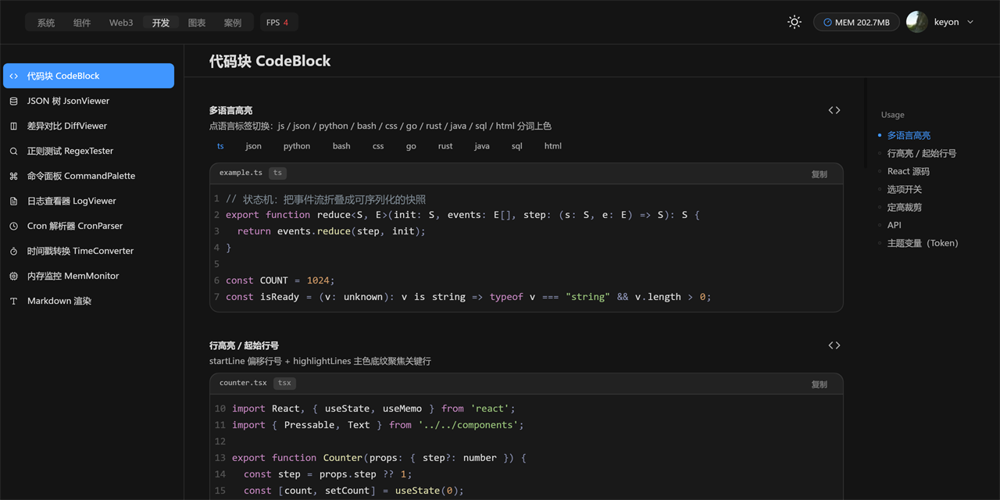
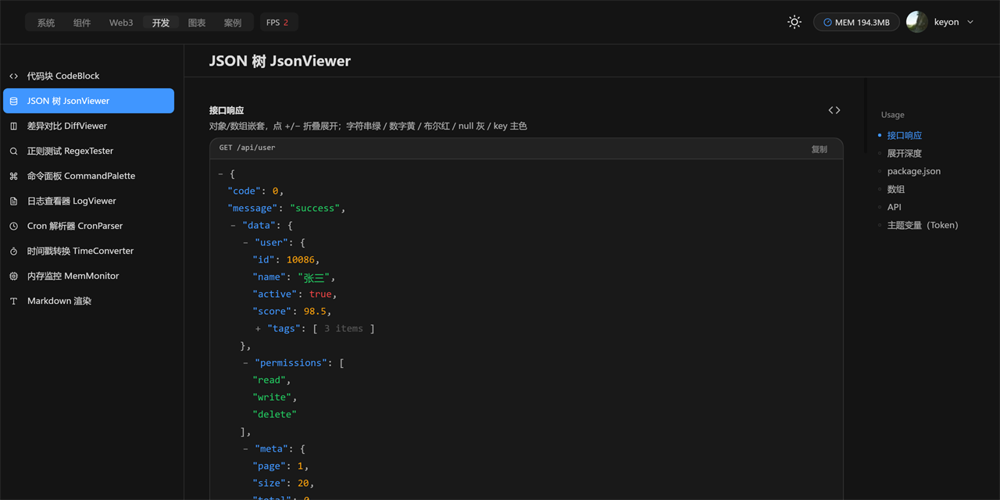
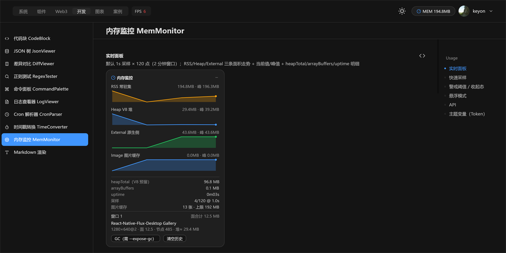

# react-native-flux-desktop-dev

> 🛠️ Developer‑facing components — terminals, code/JSON/diff viewers, log & resource monitors, Markdown.
> 🛠️ 面向开发者的组件 —— 终端、代码/JSON/差异查看器、日志与资源监控、Markdown 渲染。

  

**Depends on / 依赖：** `react-native-flux-desktop`（UI core / UI 核心）· `react-native-flux-desktop-chart`（监控曲线 / sparkline）· `react`

---



**EN** · A toolbox for dev tooling UIs: `CodeBlock` with multi‑language syntax highlighting, `JsonViewer`, `DiffViewer`, `Terminal` (pure render) / `LiveTerminal` (node‑pty) / `SshTerminal`, `LogViewer`, `CommandPalette`, `RegexTester`, `CronParser`, `TimeConverter`, plus live `MemMonitor` / `FpsMonitor` curves and a `Markdown` renderer.

**中文** · 开发者工具 UI 工具箱：`CodeBlock` 多语言语法高亮、`JsonViewer`、`DiffViewer`、`Terminal`（纯渲染）/ `LiveTerminal`（node‑pty）/ `SshTerminal`、`LogViewer`、`CommandPalette`、`RegexTester`、`CronParser`、`TimeConverter`，以及实时 `MemMonitor` / `FpsMonitor` 曲线与 `Markdown` 渲染器。

| 代码块 CodeBlock | JSON 树 JsonViewer | 内存监控 MemMonitor |
| :---: | :---: | :---: |
|  |  |  |

## Install / 安装

```bash
npm install react-native-flux-desktop react-native-flux-desktop-chart   # peers：UI 核心 + 图表
npm install react-native-flux-desktop-dev
```

## Usage / 用法

```tsx
import { CodeBlock, JsonViewer } from 'react-native-flux-desktop-dev';

export default () => (
  <>
    <CodeBlock code="export const hi = () => 'flux';" language="tsx" showLineNumbers />
    <JsonViewer data={{ ok: true, items: [1, 2, 3] }} />
  </>
);
```

## Components / 组件清单

- `Terminal` 终端（纯渲染）· `LiveTerminal` 实时终端（node‑pty）· `SshTerminal` SSH 终端
- `CodeBlock` 代码块 — 多语言高亮 / 行号 / 行高亮 / 复制
- `JsonViewer` JSON 树 · `DiffViewer` 差异对比 · `Markdown` 渲染
- `RegexTester` 正则测试 · `CommandPalette` 命令面板 · `LogViewer` 日志查看器
- `CronParser` Cron 解析（`parseCron` / `nextRuns` / `describeCron`）· `TimeConverter` 时间戳转换（`detectUnit` / `formatZoned` / `relativeTime`）
- `MemMonitor` 内存监控 · `FpsMonitor` / `useWindowFps` 帧率监控

## Notes / 说明

- **EN** `LiveTerminal` / `SshTerminal` need a native pty (`node-pty`) at runtime — treat them as optional; `Terminal` is pure rendering.
- **中文** `LiveTerminal` / `SshTerminal` 运行期需原生 pty（`node-pty`），可按需使用；`Terminal` 为纯渲染，无原生依赖。

## License / 许可证

MIT
